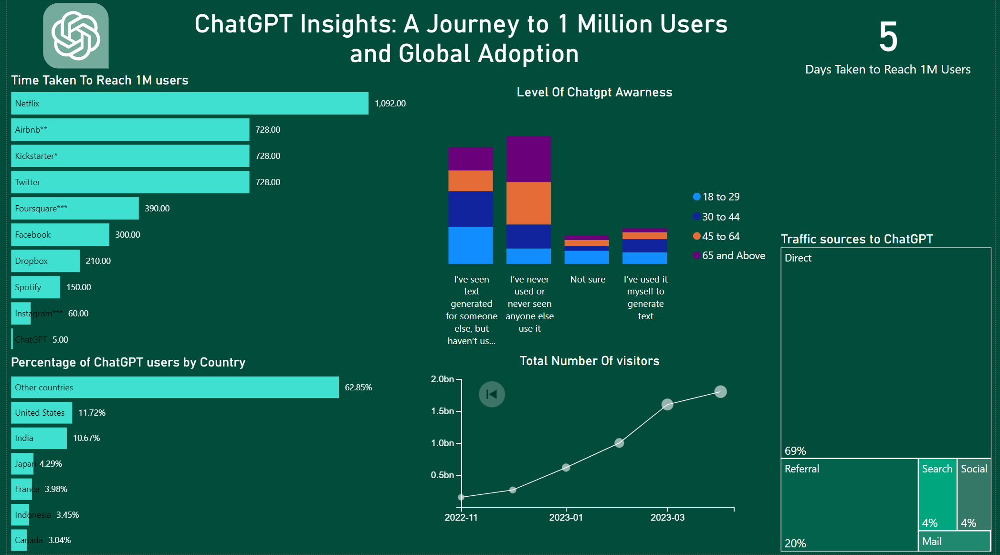
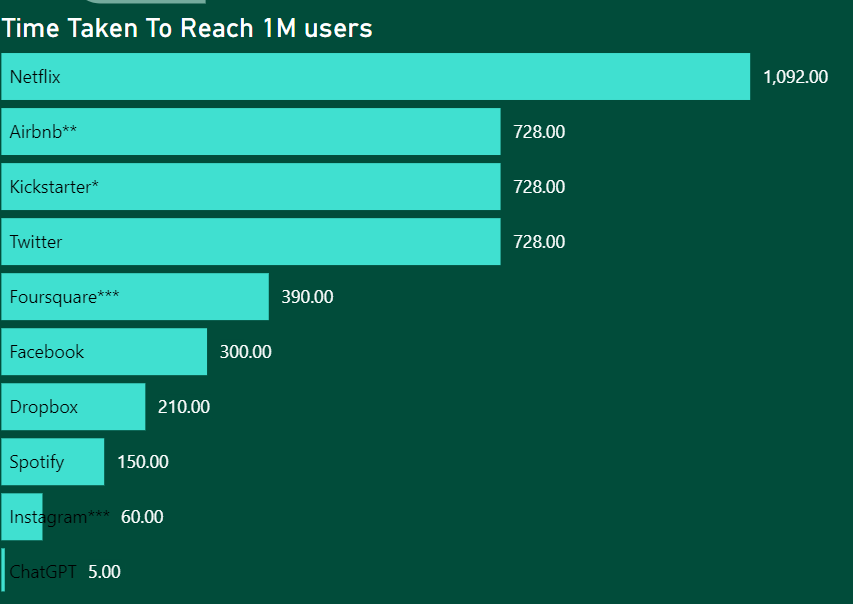
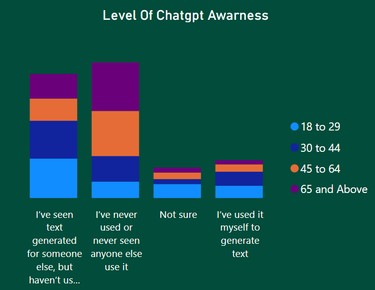
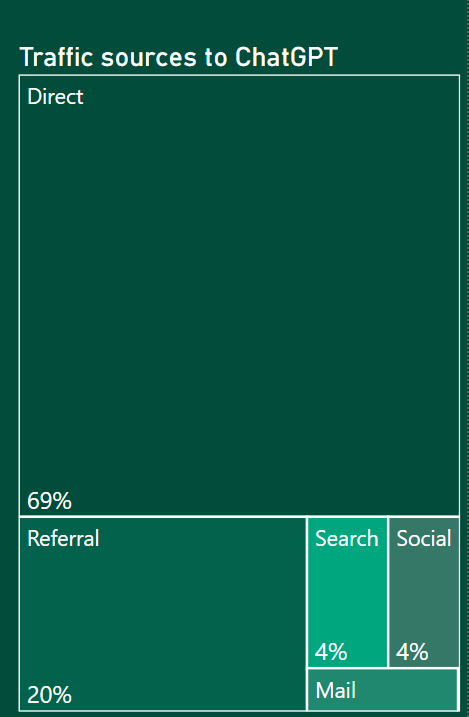
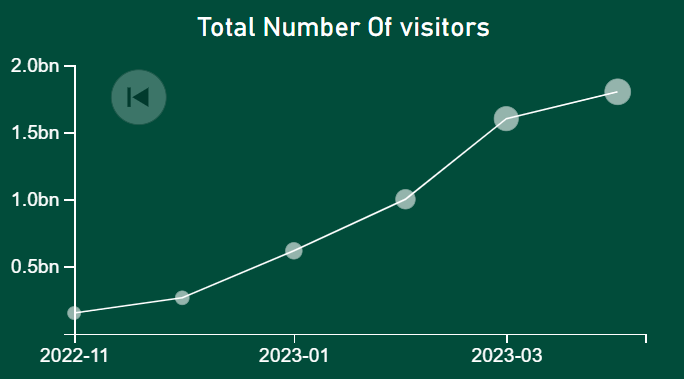
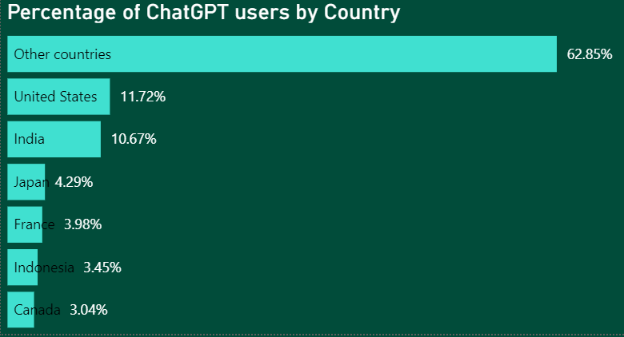

# ChatGPT Analytics Dashboard: Unveiling Usage Trends, Awareness, and Traffic Sources

## Overview
This Power BI project aims to analyze data related to ChatGPT usage, awareness, and traffic sources. The data is extracted using web scraping techniques, and the results are visualized through various graphs and KPIs on the dashboard.

## Dashboard Contents

### KPIs
- **Days to Reach 1M**: This KPI represents the number of days taken to reach one million (1M) users of ChatGPT.

### Graph 1: Time Taken to Reach 1M Users for Different Apps
This graph compares the time taken to reach one million users for different applications that utilize ChatGPT.

### Graph 2: Level of ChatGPT Awareness
This graph illustrates the level of awareness of ChatGPT among users.

### Graph 3: Traffic Sources to ChatGPT
Graph 3 displays the different sources through which users access ChatGPT.

### Graph 4: Total Number of Visitors Over the Months
Graph 4 demonstrates the overall trend of the total number of visitors to ChatGPT over the months.

### Graph 5: Counties with Highest ChatGPT Usage
Graph 5 shows which countries predominantly utilize ChatGPT services.

## Data Extraction
The data for this project is obtained using web scraping techniques. The web scraping process involves collecting information from various websites and APIs to populate the Power BI dashboard with relevant data.

## DAX Commands
DAX (Data Analysis Expressions) commands are utilized to perform data calculations and manipulations within the Power BI dashboard. These commands enable us to derive insightful metrics and KPIs.

## How to Use the Dashboard
1. Clone or download this repository to your local machine.
2. Open the Power BI file (.pbix) using Microsoft Power BI Desktop.
3. Ensure that the required data is correctly extracted by checking the data sources and connections.
4. Refresh the data if needed to get the latest insights.
5. Interact with the dashboard using various filters and slicers to explore different aspects of ChatGPT usage.

## Contributions
Contributions to this project are welcome. If you identify any issues, have suggestions for improvements, or want to add new features, feel free to submit a pull request.

## License
This project is licensed under the [MIT License](LICENSE).

### Graph 1: Time Taken to Reach 1M Users for Different Apps

### Graph 2: Level of ChatGPT Awareness

### Graph 3: Traffic Sources to ChatGPT

### Graph 4: Total Number of Visitors Over the Months

### Graph 5: Counties with Highest ChatGPT Usage

